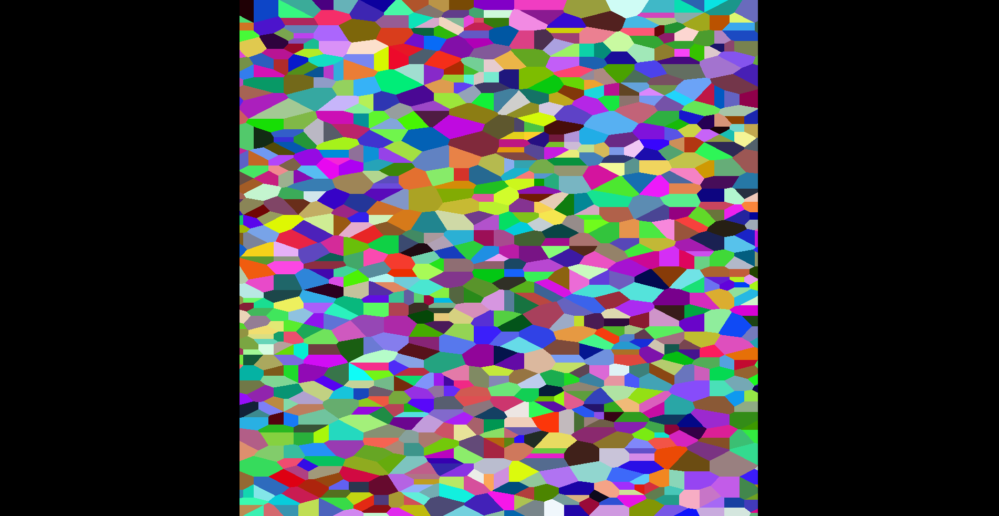

# OpenGLVoronoi

This project visualizes Voronoi diagrams using OpenGL. A Voronoi diagram partitions a plane into regions based on the distance to a set of given points. Each region contains all points closer to one particular seed point than to any other.

## Features

- Interactive visualization of Voronoi diagrams
- Change the amount of seeds updating the value of the "count" variable

## Build Instructions

To compile the project using GCC, run the following command in the project directory:

`gcc -pthread -o main main.cpp -lglfw -lGL -lglad`

Make sure you have the required libraries (`glfw`, `glad`) installed on your system.

## Example Output

## References

- [Voronoi diagram - Wikipedia](https://en.wikipedia.org/wiki/Voronoi_diagram)